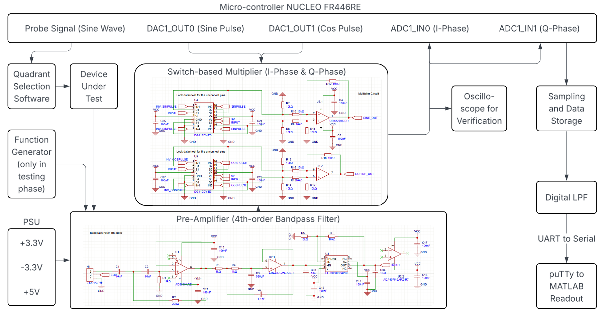
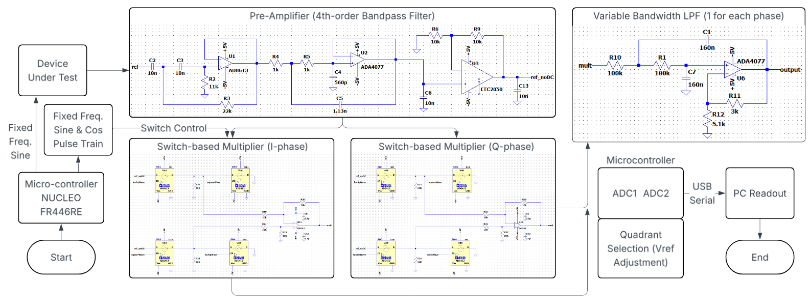
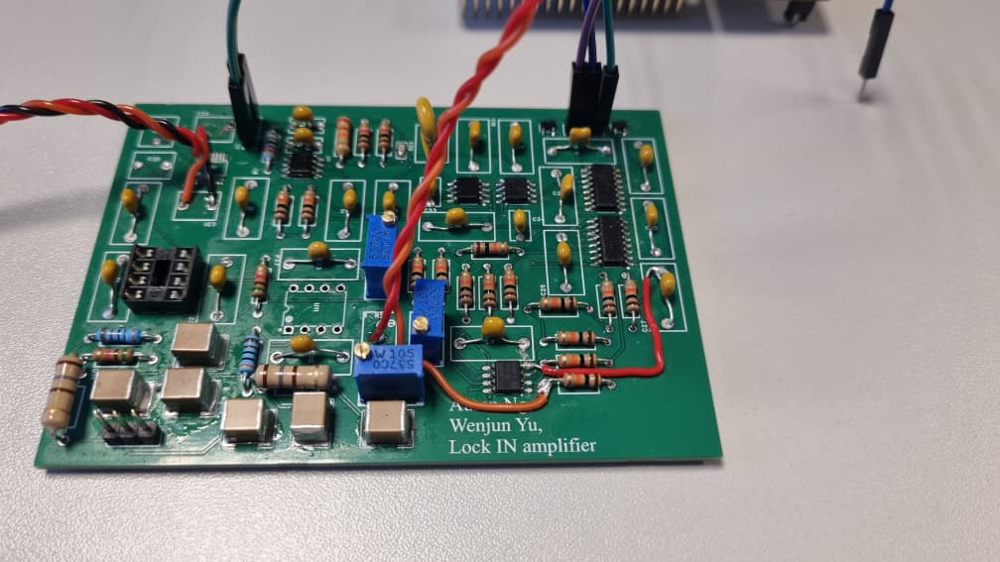
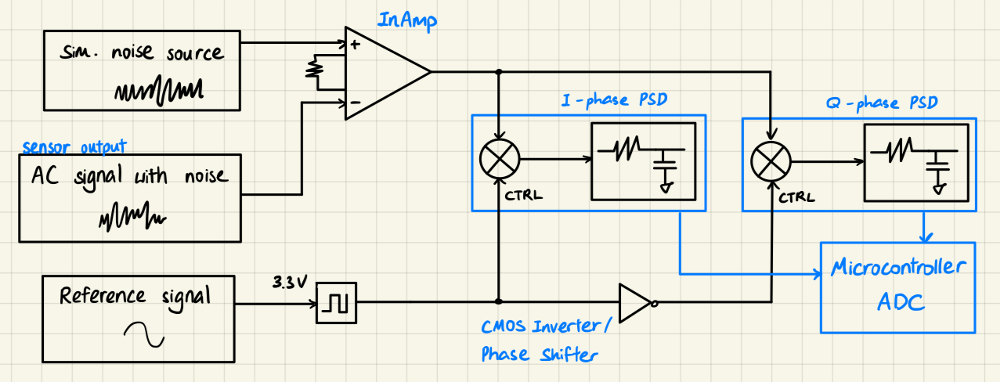

# Lock-in Amplifier

This repository documents a lock-in amplifier prototype built for Advanced Instrumentation work. Version 1 explored an analogue front end, switch-based phase-sensitive detection, and STM32 NUCLEO data acquisition. The first prototype was useful as a learning platform, but it did not meet the desired performance target, so version 2 is planned as a redesign rather than a direct continuation.

The repo is intentionally curated. It keeps the circuit-level references that are useful for the redesign and a brief public-facing summary of version 1, while leaving early firmware, MATLAB experiments, PCB manufacturing files, raw simulation outputs, and full reports out of Git for now.

## Version 1 Overview

The v1 architecture used:

- a pre-amplifier and bandpass front end for the measured AC signal
- microcontroller-generated sine and cosine pulse references
- switch-based I/Q phase-sensitive detector stages
- analogue low-pass filtering and STM32 ADC readout
- serial transfer to a PC for inspection and readout

The prototype confirmed the broad signal path and highlighted practical issues to address in v2, especially around robustness, signal conditioning, filtering choices, and implementation complexity.

## Selected V1 References

| Reference | Description |
| --- | --- |
| `LIA_SPICE_SIM/` | LTspice schematic sources for analogue circuit exploration |
| `Sim_LIA_V1.asc`, `Simulation_LIA.asc` | Root-level LTspice schematic files from early v1 work |
| `LIA_IMG/LIA_System_Mod.png` | System-level architecture diagram |
| `LIA_IMG/LIA_Flowchart.png` | Signal-flow and subsystem diagram |
| `LIA_IMG/LIA_PCB.jpg` | Assembled v1 PCB photo |
| `LIA_IMG/LIA_block.png` | Early concept block diagram |

## Repository Notes

- This repository is currently intended to be private while v2 is being designed.
- No open-source license is declared yet.
- Full v1 reports are not committed; their conclusions are summarized in `docs/v1-summary.md`.
- Generated simulation outputs, IDE metadata, firmware workspace files, MATLAB DSP drafts, and PCB production files are intentionally ignored.

## Images

## Next Direction

Version 2 should use the v1 results as design input rather than treating v1 as a finished platform. The immediate goal is to keep the repository clean enough to support that redesign: circuit references remain available, but the project history is not buried under generated files or incomplete prototype code.
